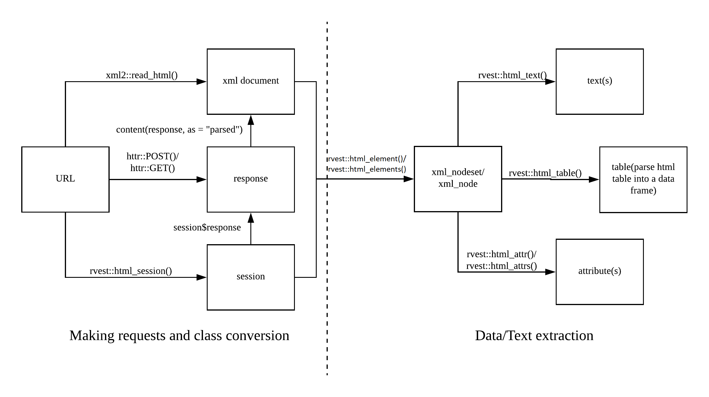

# Webscraping with R

```{r}
library(rvest)
url <- "https://ptds.samorso.ch/lectures/"

read_html(url) %>%
  html_table() %>%
  .[[1]] %>% 
  .[5:7,] %>%
  kableExtra::kable()
```

---
&nbsp;

<center>
<div style="width:600px"><iframe allow="fullscreen" frameBorder="0" height="375" src="https://giphy.com/embed/LNkZr3BhUhQvo92eRO/video" width="600"></iframe></div>
</center>

---
# Setup
* For this class, you will need (at least) the following packages:
```{r,eval=FALSE}
install.packages(c("rvest","magrittr"))
```
* You need a web browser (Chrome, Firefox, ...)

---
# API
* **A**pplication **P**rogramming **I**nterface are gold standard for fetching data from the web
* Data is fetched by directly posing HTTP requests.
* Data requests from `R` using `library(httr)` or API wrappers.

```{r, echo=FALSE}
tibble::tibble(Provider = c("Twitter","Financial Times","Open Weather Map","DeepL"),
               Registration = c(T,T,T,T),
               Wrapper = c(T,T,T,T)) %>% kableExtra::kable()
```

---
# API example
```{r}
library(pageviews)

top_articles("en.wikipedia",
             start = (Sys.Date()-1)) %>%
  dplyr::select(article, views) %>%
  dplyr::top_n(10)
```

---
# API example

```{r,echo=FALSE}
my_key <- Sys.getenv("DEEPLR")
```

```{r,cache=TRUE}
library(deeplr)
deeplr::translate2(
  text = "Mais quelle bonne traduction nom d'une pipe!",
  target_lang = "EN",
  auth_key = my_key
  )
```

This is what I obtain on Google translate:
> But what a good translation of the name of a pipe!

---
# HTTP request/response cycle
```{r,echo=F}
knitr::include_graphics("images/http_request_response.png")
```

---
# HyperText Markup Language

```{html}
<!DOCTYPE html>
<html>    
  <body>
    <h1 id='first'>Webscraping with R</h1>
    <p> Basic experience with <a href="www.r-project.org">R</a> and
    familiarity with the <em>Tidyverse</em> is recommended.</p>
    <h2>Technologies</h2>
    <ol>
      <li>HTML: <em>Hypertext Markup Language</em></li>
      <li>CSS: <em>Cascading Style Sheets</em></li>
    </ol>
    <h2>Packages</h2>
    <ul>
      <a href="https://github.com/tidyverse/rvest"><li>rvest</li></a>
    </ul>
    <p><strong>Note</strong>:
    <em>rvest</em> is included in the <em>tidyverse</em></p>
  </body>
</html>
```

.bottom[[Try it!](https://www.w3schools.com/html/tryit.asp?filename=tryhtml_default)]

---
# HTML
* **element** starts with `<tag>` and ends `</tag>`,
* it has optional **attributes** (`id=attribute`),
* **content** is everything between two tags.

&nbsp;

&nbsp;

&nbsp;

&nbsp;

&nbsp;

&nbsp;


.center[
Add the attribute `style="background-color:DodgerBlue;"` to `h1` and try it.
]

---
# HTML elements

tag	| meaning
--- | ---
p |	Paragraph
h1 | Top-level heading
h2, h3, ... |	Lower level headings
ol | Ordered list
ul | Unorder list
li | List item
img |	Image
a |	Anchor (Hyperlink)
div |	Section wrapper (block-level)
span | Text wrapper (in-line)

Find out more [tags](https://developer.mozilla.org/en-US/docs/Web/HTML)

---
# CSS
```{html}
<!DOCTYPE html>
<html>    
<head>
<style>
body {
  background-color: lightblue;
}
h1 {
  color: white;
  text-align: center;
}
.content {
font-family: monospace;
font-size: 1.5em;
color: black;
}
#intro {
  background-color: lightgrey;
  border-style: solid;
  border-width: 5px;
  padding: 5px;
  margin: 5px;
  text-align: center;
}
</style>
</head>
<body>
...
```


---
# Data extraction
Create a HTML page with `minimal_html` for experimenting
```{r}
html_page <- minimal_html('
  <body>
    <h1>Webscraping with R</h1>
    <p> Basic experience with <a href="www.r-project.org">R</a> and
    familiarity with the <em>Tidyverse</em> is recommended.</p>
    <h2>Technologies</h2>
    <ol>
      <li>HTML: <em>Hypertext Markup Language</em></li>
      <li>CSS: <em>Cascading Style Sheets</em></li>
    </ol>
    <h2>Packages</h2>
    <ul>
      <a href="https://github.com/tidyverse/rvest"><li>rvest</li></a>
    </ul>
    <p><strong>Note</strong>:
    <em>rvest</em> is included in the <em>tidyverse</em></p>
  </body>')
```

---
# HTML elements
```{html}
...
    <h2>Technologies</h2>
    <ol>
      <li>HTML: <em>Hypertext Markup Language</em></li> #<<
      <li>CSS: <em>Cascading Style Sheets</em></li> #<<
    </ol>
    <h2>Packages</h2>
    <ul>
      <a href="https://github.com/tidyverse/rvest"><li>rvest</li></a> #<<
    </ul>
...
```
```{r}
html_page %>% html_nodes("li")
html_page %>% html_nodes("li") %>% html_text()
```

---
```{html}
    <p> Basic experience with <a href="www.r-project.org">R</a> and
    familiarity with the <em>Tidyverse</em> is recommended.</p> #<<
    <h2>Technologies</h2>
    <ol>
      <li>HTML: <em>Hypertext Markup Language</em></li> #<<
      <li>CSS: <em>Cascading Style Sheets</em></li> #<<
    </ol>
    <h2>Packages</h2>
    <ul>
      <a href="https://github.com/tidyverse/rvest"><li>rvest</li></a>
    </ul>
    <p><strong>Note</strong>:
    <em>rvest</em> is included in the <em>tidyverse</em></p> #<<
```
```{r}
html_page %>% html_nodes("em") %>% html_text()
```

---
# CSS selector

selector |	meaning
--- | ---
,	| grouping
space	| descendant
>	| child
+ | adjacent sibling
~ | general sibling
:first-child |	first element
:nth-child(n)	| n element
:last-child	| last element
.	| class selector
#	| id selector

.center[[CSS diner](https://flukeout.github.io/)
[CSS selector](https://developer.mozilla.org/en-US/docs/Web/CSS/CSS_Selectors)]

---
```{html}
    <p> Basic experience with <a href="www.r-project.org">R</a> and
    familiarity with the <em>Tidyverse</em> is recommended.</p> 
    <h2>Technologies</h2>
    <ol>
      <li>HTML: <em>Hypertext Markup Language</em></li> 
      <li>CSS: <em>Cascading Style Sheets</em></li> 
    </ol>
    <h2>Packages</h2>
    <ul>
      <a href="https://github.com/tidyverse/rvest"><li>rvest</li></a>
    </ul>
    <p><strong>Note</strong>:
    <em>rvest</em> is included in the <em>tidyverse</em></p>
```
```{r}
html_page %>% html_nodes("li, em") %>% html_text()
```

---
```{html}
    <p> Basic experience with <a href="www.r-project.org">R</a> and
    familiarity with the <em>Tidyverse</em> is recommended.</p> 
    <h2>Technologies</h2>
    <ol>
      <li>HTML: <em>Hypertext Markup Language</em></li> 
      <li>CSS: <em>Cascading Style Sheets</em></li> 
    </ol>
    <h2>Packages</h2>
    <ul>
      <a href="https://github.com/tidyverse/rvest"><li>rvest</li></a>
    </ul>
    <p><strong>Note</strong>:
    <em>rvest</em> is included in the <em>tidyverse</em></p>
```
```{r}
html_page %>% html_nodes("li em") %>% html_text()
```
---
```{html}
    <p> Basic experience with <a href="www.r-project.org">R</a> and
    familiarity with the <em>Tidyverse</em> is recommended.</p> 
    <h2>Technologies</h2>
    <ol>
      <li>HTML: <em>Hypertext Markup Language</em></li> 
      <li>CSS: <em>Cascading Style Sheets</em></li> 
    </ol>
    <h2>Packages</h2>
    <ul>
      <a href="https://github.com/tidyverse/rvest"><li>rvest</li></a>
    </ul>
    <p><strong>Note</strong>:
    <em>rvest</em> is included in the <em>tidyverse</em></p>
```
```{r}
html_page %>% html_nodes("p > em") %>% html_text()
```
---
```{html}
    <p> Basic experience with <a href="www.r-project.org">R</a> and
    familiarity with the <em>Tidyverse</em> is recommended.</p> 
    <h2>Technologies</h2>
    <ol>
      <li>HTML: <em>Hypertext Markup Language</em></li> 
      <li>CSS: <em>Cascading Style Sheets</em></li> 
    </ol>
    <h2>Packages</h2>
    <ul>
      <a href="https://github.com/tidyverse/rvest"><li>rvest</li></a>
    </ul>
    <p><strong>Note</strong>:
    <em>rvest</em> is included in the <em>tidyverse</em></p>
```
```{r}
html_page %>% html_nodes("p + em") %>% html_text()
html_page %>% html_nodes("em + em") %>% html_text()
```

---
```{html}
    <p> Basic experience with <a href="www.r-project.org">R</a> and
    familiarity with the <em>Tidyverse</em> is recommended.</p> 
    <h2>Technologies</h2>
    <ol>
      <li>HTML: <em>Hypertext Markup Language</em></li> 
      <li>CSS: <em>Cascading Style Sheets</em></li> 
    </ol>
    <h2>Packages</h2>
    <ul>
      <a href="https://github.com/tidyverse/rvest"><li>rvest</li></a>
    </ul>
    <p><strong>Note</strong>:
    <em>rvest</em> is included in the <em>tidyverse</em></p>
```
```{r}
html_page %>% html_nodes("li:first-child") %>% html_text()
html_page %>% html_nodes("li:nth-child(2)") %>% html_text()
html_page %>% html_nodes("ol> li:last-child") %>% html_text()
```
---
# HTML attributes
```{html}
    <p> Basic experience with <a href="www.r-project.org">R</a> and
    familiarity with the <em>Tidyverse</em> is recommended.</p> 
    <h2>Technologies</h2>
    <ol>
      <li>HTML: <em>Hypertext Markup Language</em></li> 
      <li>CSS: <em>Cascading Style Sheets</em></li> 
    </ol>
    <h2>Packages</h2>
    <ul>
      <a href="https://github.com/tidyverse/rvest"><li>rvest</li></a>
    </ul>
    <p><strong>Note</strong>:
    <em>rvest</em> is included in the <em>tidyverse</em></p>
```
```{r}
html_page %>% html_nodes("a") %>% html_attr("href")
html_page %>% html_nodes("ul a") %>% html_attr("href")
```

---
# HTML tables

tag |	meaning
--- | ---
table |	Table section
tr |	Table row
td |	Table cell
th |	Table header

---
```{r}
basic_table <- minimal_html('
<body>
<table>
  <tr>
    <th>Month</th>
    <th>Savings</th>
  </tr>
  <tr>
    <td>January</td>
    <td>$100</td>
  </tr>
  <tr>
    <td>February</td>
    <td>$80</td>
  </tr>
</table>
</body>
')
```
```{r}
basic_table %>% html_table()
```

---
# Cheat sheet
```{r,echo=FALSE,fig.align='center',out.height=450,out.width=810}

```
.center[<https://github.com/yusuzech/r-web-scraping-cheat-sheet/>]

---
# Why web scraping could be bad?
* Scraping increases traffic.
* People ignore and violate `robots.txt` and Terms of Service (ToS) of websites.
* Avoid trouble following these simple rules:
1. Read ToS of the website you want to scrap.
2. Inspect `robots.txt` (see <https://cran.r-project.org/robots.txt> for instance).
3. Use a reasonable frequency of requests.

---
class: sydney-blue, center, middle

# Question ?

.pull-down[
<a href="https://ptds.samorso.ch/">
.white[`r icons::fontawesome("file")` website]
</a>

<a href="https://github.com/ptds2021/">
.white[`r icons::fontawesome("github")` GitHub]
</a>
]

---
# In-class exercises (10 min)
* Play with [CSS Diner](https://flukeout.github.io/)
* Try this [workflow](https://smac-group.github.io/ds/section-web-scraping.html#section-workflow) 

---
# To go further
* More details and examples in the book [An Introduction to Statistical Programming Methods with R](https://smac-group.github.io/ds/section-web-scraping.html)
* <https://github.com/yusuzech/r-web-scraping-cheat-sheet/>
* Want to build your own R API wrapper? Have a look at <https://colinfay.me/build-api-wrapper-package-r/> and <https://cran.r-project.org/web/packages/httr/vignettes/api-packages.html>
* [Datacamp](https://www.datacamp.com/courses/web-scraping-in-r) class on webscraping with R
* [Automated Data Collection with R: A Practical Guide to Web Scraping and Text Mining](https://www.wiley.com/en-us/Automated+Data+Collection+with+R%3A+A+Practical+Guide+to+Web+Scraping+and+Text+Mining-p-9781118834817)
